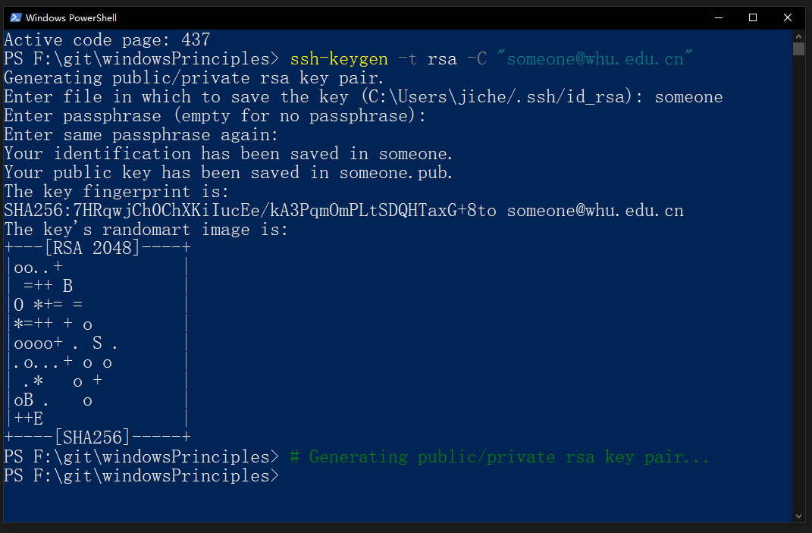

# gitee 生成/添加 SSH 密钥
___

[参见码云帮助中心的相关文档](https://gitee.com/help/articles/4181#article-header0)

## 1. SSH 密钥的生成

码云提供了基于SSH协议的Git服务，在使用SSH协议访问仓库仓库之前，
需要先配置好账户/仓库的SSH公钥。

我们使用 win10 的 **power shell** 执行如下命令来生成 sshkey:

```c
chcp 437

ssh-keygen -t rsa -C "someone@whu.edu.cn" 
# Generating public/private rsa key pair...
```

上述命令的效果如下：



执行的结果是在 ~/.ssh/ 文件夹下生成了 id_rsa 与 id_rsa.pub 两个文件。
其中 id_rsa 是私钥，而 id_rsa.pub 是公钥。如果你在生成密钥的过程中输入了文件名，
则可能在当前文件夹下生成与你所输入文件名相应的私钥和公钥，这时为了让 ssh 能顺利
和 gitee 建立通信，你需要将私钥拷贝到 ~/.ssh/ 文件夹下并改名为 id_rsa。不然
后面会出错。_
使用 cat 命令来查看一下生成的 rsa 公钥，结果如下：


## 2. 向码云网站添加仓库公钥或者账户公钥

### 2.1 添加仓库公钥
复制生成后的 ssh key，通过仓库主页 「管理」->「部署公钥管理」->「添加部署公钥」，
添加生成的 public key 添加到仓库中。

部署公钥允许以只读的方式访问仓库，主要用于仓库在生产服务器的部署上，
免去HTTP方式每次操作都要输入密码和普通SSH方式担心不小心修改仓库代码的麻烦。
部署公钥配置后的机器，只支持clone与pull等只读操作。
如果您想要对仓库进行写操作，请添加个人公钥。

### 2.2 添加个人账户公钥
个人公钥的添加方法：

点击右上角个人账户中的设置，然后点击“安全设置”中的“SSH 公钥”，将生成的公钥粘贴进去并确定。
此时需要输入账号的密码。

添加完成后在 powershell 中输入
```c
ssh -T git@gitee.com
```
如果出现如下显示结果则表明 ssh 密钥添加成功


### 2,3 添加密钥出错的解决方法

如果出现类似如下信息则说明出错：
```c
git@gitee.com: Permission denied (publickey).
```
这多半是你没有将私钥拷贝到 ~/.ssh/ 文件夹下并改名为 id_rsa。另一种情况是在你生成 SSH 
密钥是你没有使用你在 gitee 账户上的登录邮箱，也可能导致类似错误。

参见 <https://blog.csdn.net/weixin_43889439/article/details/92760952>

如果在 git push 时出现用户名或密码错误，这个时候可能不是密钥的问题。
可以在 win10 的凭据管理器中对 windows 凭据中的 git:https://gitee.com 进行修改，
将用户名和密码都正确填写。


